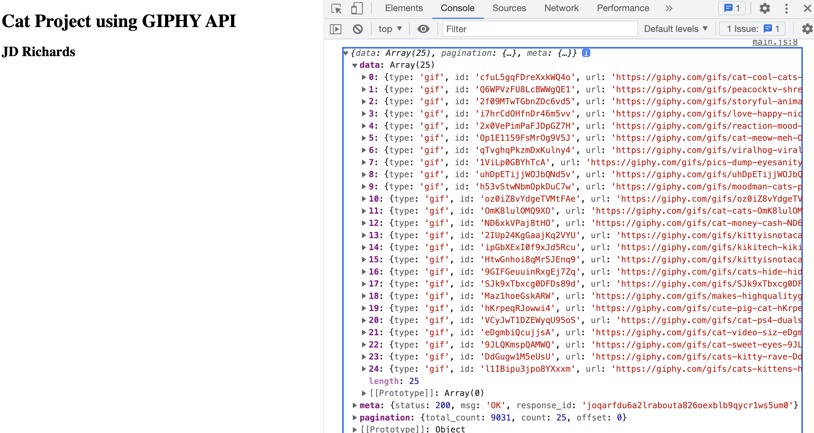

# Front-End-Portfolio-Project

## JD Richards

I will create an application using the GIPHY API for data.

USER STORIES:

- As a user, when I visit the website I see a way to navigate to multiple pages.
- As a user I can click on an About link so that it will navigate to a new page where I see information about the developer.
- As a user, information about users is retrieved from an API so that I can see a list of photos to click on.
- As a user, I can type in an input box and search for a photo based on the input, (e.g. cats) so that a new stream of photos will appear based on that theme.
- As a user, if I try to submit with no entry in the input box, I see a message on the screen telling me to enter a value to search so that I cannot submit without entering a value
- As a user, I can click on a photo so that I can view a single photo with information about that photo

### Data Snapshot

